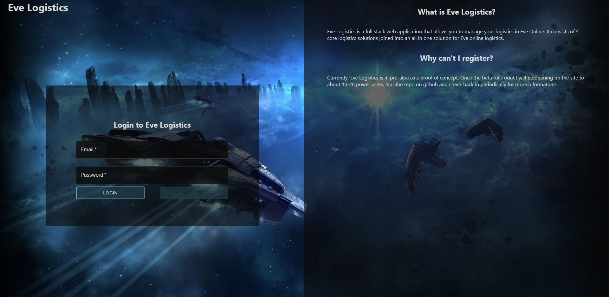

<div id="top"></div>

[![Contributors][contributors-shield]][contributors-url]
[![Forks][forks-shield]][forks-url]
[![Stargazers][stars-shield]][stars-url]
[![Issues][issues-shield]][issues-url]
[![License][license-shield]][license-url]
[![Website][live-site-shield]][live-site-url]


<!-- PROJECT LOGO -->
<br />
<div align="center">

<h1 align="center">Eve Logistics</h1>

  <p align="center">
    Eve Logistics is a full stack web application that allows you to manage your logistics in Eve Online. 
    <br />
    It consists of 4 core logistics solutions joined into an all in one solution for Eve online logistics. 
    <br />
    <br />
    Eve Logistics is in pre-alpa as a proof of concept. 
    <br />
    Once the beta rolls out I will be opening up the site to about 10-20 power users. 
    <br />
    Star the repo on github and check back in periodically for more information!
    <br />
    <a href="#demo">View Demo</a>
    ·
    <a href="https://github.com/Revivedaniel/EveLogistics-Frontend/issues">Report Bug</a>
    ·
    <a href="https://github.com/Revivedaniel/EveLogistics-Frontend/issues">Request Feature</a>
  </p>
</div>


<!-- TABLE OF CONTENTS -->
<details>
  <summary>Table of Contents</summary>
  <ol>
    <li>
      <a href="#about-the-project">About The Project</a>
      <ul>
        <li><a href="#built-with">Built With</a></li>
      </ul>
    </li>
    <li>
      <a href="#getting-started">Getting Started</a>
      <ul>
        <li><a href="#prerequisites">Prerequisites</a></li>
        <li><a href="#installation">Installation</a></li>
      </ul>
    </li>
    <li><a href="#roadmap">Roadmap</a></li>
    <li><a href="#contributing">Contributing</a></li>
    <li><a href="#license">License</a></li>
    <li><a href="#contact">Contact</a></li>
  </ol>
</details>


<!-- ABOUT THE PROJECT -->
## About The Project

[](https://www.eveonlinelogistics.com/)

<p align="right">(<a href="#top">back to top</a>)</p>


### Built With

* [Typescript](https://www.typescriptlang.org/)
* [React](https://reactjs.org/)
* [Axios](https://www.npmjs.com/package/axios)
* [MaterialUI](https://mui.com/)
* [Node.js](https://nodejs.org/en/)
* [ESLint](https://eslint.org/)


<p align="right">(<a href="#top">back to top</a>)</p>

## Demo


<!-- GETTING STARTED -->
## Getting Started

Get a local copy up and running by following these simple steps.

### Prerequisites

The latest version of npm and Node.js v16.13.2+ are required to run a local copy of this project.

### Installation

1. Clone the repo
   ```sh
   git clone https://github.com/Revivedaniel/EveLogistics-Frontend.git
   ```
2. Install NPM packages
   ```sh
   npm install
   ```
3. Start the server
   ```sh
   npm start
   ```

<p align="right">(<a href="#top">back to top</a>)</p>

<!-- ROADMAP -->
## Roadmap

- Update login to Eve Online SSO
- Connect the ESI Rest API
- Continue developing individual solutions

See the [open issues](https://github.com/Revivedaniel/EveLogistics-Frontend/issues) for a full list of proposed features (and known issues).

<p align="right">(<a href="#top">back to top</a>)</p>


<!-- CONTRIBUTING -->
## Contributing

Currently, I am not looking for contributions since this is an alpha build.
But you are more than welcome to submit issues that I can get back to later!

<p align="right">(<a href="#top">back to top</a>)</p>


<!-- LICENSE -->
## License

Distributed under the GPL-2.0 License. See `LICENSE.txt` for more information.

<p align="right">(<a href="#top">back to top</a>)</p>


<!-- CONTACT -->
## Contact

Daniel Stark - contact@danielstark.dev

<p align="right">(<a href="#top">back to top</a>)</p>

[contributors-shield]: https://img.shields.io/github/contributors/Revivedaniel/EveLogistics-Frontend.svg?style=for-the-badge
[contributors-url]: https://github.com/Revivedaniel/EveLogistics-Frontend/graphs/contributors
[forks-shield]: https://img.shields.io/github/forks/Revivedaniel/EveLogistics-Frontend.svg?style=for-the-badge
[forks-url]: https://github.com/Revivedaniel/EveLogistics-Frontend/network/members
[stars-shield]: https://img.shields.io/github/stars/Revivedaniel/EveLogistics-Frontend.svg?style=for-the-badge
[stars-url]: https://github.com/Revivedaniel/EveLogistics-Frontend/stargazers
[issues-shield]: https://img.shields.io/github/issues/Revivedaniel/EveLogistics-Frontend.svg?style=for-the-badge
[issues-url]: https://github.com/Revivedaniel/EveLogistics-Frontend/issues
[license-shield]: https://img.shields.io/github/license/Revivedaniel/EveLogistics-Frontend.svg?style=for-the-badge
[license-url]: https://github.com/Revivedaniel/EveLogistics-Frontend/blob/main/LICENSE
[live-site-url]: https://www.eveonlinelogistics.com/
[live-site-shield]: https://img.shields.io/website?label=EveOnlineLogistics.com&style=for-the-badge&url=https%3A%2F%2Fwww.eveonlinelogistics.com/
